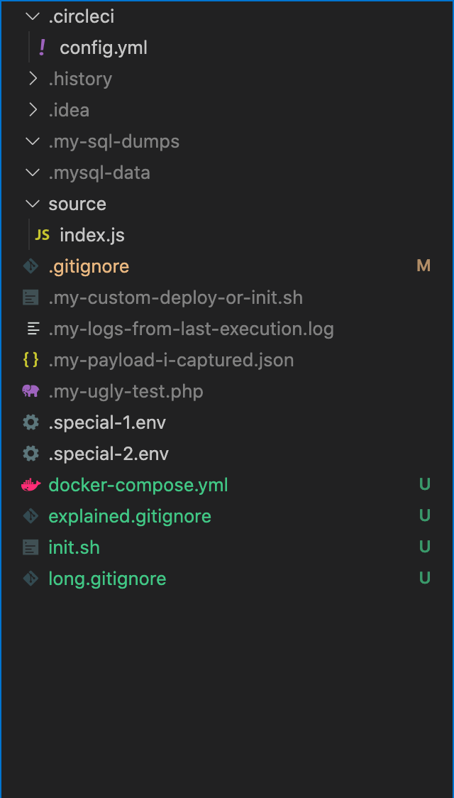

# Synopsis

I've noticed developers often build a huge list of folders and files in the .gitignore file. A list that consist of system files like `.DS_Store` and other project unrelated folders like `.vscode`.  This repo tried to demonstrates a practice that can be very useful and more related to your project.

# The gitignore

So instead of trying to build a possible list of dotted folders and files that is created by editors and tools, we just ignore every dotted folder by default
```
.*
```

Then we build a smaller list of what we what to exclude from ignoring (normally this list is smaller, since it is only a few special ones):

First the 2 basic git files:
```
!.gitignore
!.gitkeep
```

then a few intentionally dotted but meant to be included files and folders
```
!.circleci
!.gitlab-ci.yml
!.special-1.env
!.special-2.env
```

Then we can start ignoring special folders and files.  
Although most of the time you have control of them, like in this example you can tell the unit testing framework to use a dotted folder for coverage output, for example: `.coverage`.  
Of course, there's always some exceptions, but usually just a few ones, so this list is normally small too.
```
coverage
```

# Final Notes
So excluding all dotted folder by default combining with a few practices can results a very small and minimalistic .gitignore file, that is easy to read and easy to manage.  
Building a list of possible dotted folders could be a never-ending struggle, since every tool and editor can have its own sets and even the OS can create its own ones.  
Moreover dotted folders and files in *nix based OSes meant to be hidden and excluded. 

And last but not least, also has the benefit, that the developer can create his own custom files that they don't want to commit nor include. For example a special build script for docker or some drafts that may evolve to a committable state later.

The biggest benefit of having all dotted files and folders ignored by default, is that as a developer I can create custom and/or temporary files which are going to be persistent in all situations. Situations like stashing your work, to check if another branch works on your tests, or to copy snippets from other branches. Situations like changing branches because you finished a task and you open a new one. Situations when you merge the latest master into your branch. And also protects us from accidentally committing files not meant to be committed.


# And a screenshot from vscode
